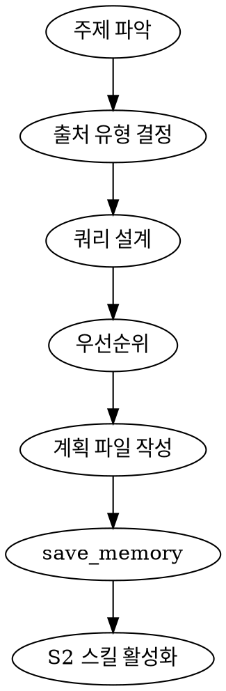

# SP-0 Phase 2 — Category C Deep Dive

**Date**: 2026-04-12
**Sub-agent**: Sonnet 4.6
**Category**: C — Workflow Enforcement (코드 레벨 심화)
**Phase 1 참조**: scan-C-workflow-enforcement.md

---

## 심화 분석

### 1. PR #17760 진행 상황

#### 직접 Fetch 결과 (2026-04-12 기준)

**Issue #17760**: "Subagent Configurability - Tools, policy, hooks, skills, schema, etc"
- **URL**: https://github.com/google-gemini/gemini-cli/issues/17760
- **상태**: **OPEN** (미완료)
- **생성일**: 2026-01-28
- **최종 업데이트**: 2026-04-12T12:20:23Z (오늘, 활성)
- **라벨**: `area/agent`, `🔒 maintainer only`, `workstream-rollup`
- **Milestone**: 없음 (타임라인 불명확)

#### 이슈 본문 핵심

> "As we continue to add features: plan mode, skills, tasks/todo, etc., we must ensure that we are properly tracking what this means in the scope of subagents. Do they require additional configurability? Should we exclude certain things? This epic tracks this work to ensure our subagents are highly capable and have access to the same tools and allow users to make use of them."

Phase 1 보고서에서 "0/30 완료"로 기재했으나, 이것은 GitHub 태스크 체크리스트가 아닌 이슈 내용 자체가 에픽(workstream-rollup 라벨)이었던 것. **진행 상황을 수치로 추적하는 공개된 체크리스트는 없다.** 하위 작업들은 별도 이슈로 분리되어 있다.

#### 연관 작업 (실제 진행 확인)

Phase 1 이후 이 에픽 하에서 진행된 관련 작업:

| PR/Issue | 제목 | 상태 | 날짜 |
|---------|------|------|------|
| #25092 | feat(core): persist subagent agentId in tool call records | **Merged** | 2026-04-10 |
| #25053 | refactor(core): remove legacy subagent wrapping tools | **Merged** | 2026-04-09 |
| #25048 | fix(core): remediate subagent memory leaks using AbortSignal | **Merged** | 2026-04-09 |
| #25033 | feat(hooks): add agent_name field to BeforeAgent/AfterAgent | **OPEN** | 2026-04-10 |
| #25148 | feat(core): add skill patching support with /memory inbox integration | **OPEN** | 2026-04-10 |

**`agent_name` 필드 추가 (PR #25033)** — 아직 머지 안 됨, 매우 중요한 개선:
```bash
# hook script에서 subagent와 main agent를 구분하는 패턴
agent_name=$(echo "$input" | jq -r '.agent_name // empty')
if [ -n "$agent_name" ]; then
  # subagent 실행 중 — AfterAgent hook 스킵
  echo '{"continue": true}'
  exit 0
fi
# main agent 전용 로직 처리
```
이 PR이 머지되면 DRLLM의 AfterAgent hook에서 "S1→S2 게이트는 main agent에만 적용"을 정확히 구현할 수 있다.

#### 스킬 접근 관련 현재 상태

공식 문서(`docs/cli/skills.md`)와 소스 기준:
- **Skills는 현재 main agent 전용** — subagent 정의(`.gemini/agents/*.md` frontmatter)에 `activate_skill`을 허용하는 공식 `tools` 항목이 없다.
- `activate_skill` 도구는 공식 문서에서 "used exclusively by the Gemini agent" — 메인 에이전트 전용임을 명시.
- Subagent가 `tools: [*]` 와일드카드를 받아도 다른 subagent를 호출할 수 없으며, `activate_skill` 포함 여부는 명시 없음.

#### DRLLM 일정 영향

**영향 평가**: 중간

- 병렬 dispatch는 여전히 불가 → DRLLM S2(Research Execution)의 병렬 검색은 MCP 도구 레벨에서 우회 필요
- `agent_name` hook 개선(#25033)이 머지되면 AfterAgent hook의 정밀도가 크게 향상됨 → DRLLM Hard Gate 구현 품질 개선
- Skill patching (#25148) 머지 시 S4(Adaptive Tutoring) 스킬의 점진적 업데이트 가능
- **SP-1 설계는 현재 상태(병렬 불가, 스킬 subagent 미지원)를 기반으로 진행해야 함**. #17760이 닫힐 때까지 기다리는 것은 비현실적.

---

### 2. AfterAgent Hook 전환 게이트 — 코드 레벨 분석

#### decision: "deny" + reason 패턴의 실제 동작

공식 reference 문서(`docs/hooks/reference.md`) 기준:

```
AfterAgent → decision: "deny" 흐름:
  1. 에이전트가 응답 완료
  2. AfterAgent hook 실행 (stdin으로 prompt + prompt_response + stop_hook_active 수신)
  3. hook이 exit 0 + {"decision": "deny", "reason": "<텍스트>"} 반환
  4. CLI가 reason을 에이전트에 새 프롬프트로 재전송 (retry turn 시작)
  5. 에이전트가 reason에 따라 재시도
  6. stop_hook_active = true 상태에서 AfterAgent 재실행
```

핵심 필드:
- `stop_hook_active`: boolean — 현재 retry 루프 안에 있음을 의미. **무한 루프 방지 로직 필수**
- `hookSpecificOutput.clearContext`: true 시 LLM 대화 기록 클리어 (UI 유지)
- `continue: false`: retry 없이 세션 전체 종료

#### DRLLM 전환 게이트 Hook 스크립트 예제 (실제 작동 가능)

**S1→S2 게이트: Research Planning 완료 검증**

```bash
#!/usr/bin/env bash
# .gemini/hooks/gate-s1-to-s2.sh
# S1 스킬이 완료되었는지 확인: research_plan.md가 존재해야 S2 진입 허용

input=$(cat)
stop_hook_active=$(echo "$input" | jq -r '.stop_hook_active')

# 무한 루프 방지: 이미 retry 중이면 통과
if [ "$stop_hook_active" = "true" ]; then
  echo '{"decision": "allow"}'
  exit 0
fi

# agent_name 필드 체크 (PR #25033 머지 후 사용 가능)
# 현재는 주석 처리, 머지 후 활성화
# agent_name=$(echo "$input" | jq -r '.agent_name // empty')
# if [ -n "$agent_name" ]; then
#   echo '{"decision": "allow"}'
#   exit 0
# fi

# S2 진입 전 계획 파일 존재 확인
PLAN_FILE=".gemini/drllm-state/research_plan.md"

if [ ! -f "$PLAN_FILE" ]; then
  # 계획 파일 없음 → S2 진입 차단
  cat <<EOF
{
  "decision": "deny",
  "reason": "GATE-S1-S2: research_plan.md가 존재하지 않습니다. S2(Research Execution)로 진행하기 전에 S1(Research Planning) 스킬을 완료하여 .gemini/drllm-state/research_plan.md를 생성해야 합니다. activate_skill을 사용하여 S1 스킬을 활성화하고 연구 계획을 먼저 작성하십시오.",
  "systemMessage": "S1→S2 게이트: 연구 계획 미완료"
}
EOF
  exit 0
fi

# 계획 파일 품질 검증 (최소 구조 확인)
if ! grep -q "## 검색 전략" "$PLAN_FILE" 2>/dev/null; then
  cat <<EOF
{
  "decision": "deny",
  "reason": "GATE-S1-S2: research_plan.md가 존재하지만 '## 검색 전략' 섹션이 누락되었습니다. 계획이 불완전합니다. S1 스킬로 돌아가 검색 전략을 추가하십시오.",
  "systemMessage": "S1→S2 게이트: 계획 불완전"
}
EOF
  exit 0
fi

echo '{"decision": "allow"}'
exit 0
```

**settings.json 등록:**

```json
{
  "hooks": {
    "AfterAgent": [
      {
        "matcher": "*",
        "hooks": [
          {
            "name": "gate-s1-to-s2",
            "type": "command",
            "command": "bash .gemini/hooks/gate-s1-to-s2.sh",
            "timeout": 5000,
            "description": "S1→S2 전환 게이트: 연구 계획 완료 검증"
          }
        ]
      }
    ]
  }
}
```

**S2→S3 게이트: 출처 라벨링 완료 검증**

```bash
#!/usr/bin/env bash
# .gemini/hooks/gate-s2-to-s3.sh

input=$(cat)
stop_hook_active=$(echo "$input" | jq -r '.stop_hook_active')

if [ "$stop_hook_active" = "true" ]; then
  echo '{"decision": "allow"}'
  exit 0
fi

RESULTS_FILE=".gemini/drllm-state/research_results.md"

if [ ! -f "$RESULTS_FILE" ]; then
  echo '{"decision": "allow"}'  # S2가 아직 실행 안 됨 — 통과 (다른 게이트가 처리)
  exit 0
fi

# 출처 라벨 없는 줄이 있으면 차단
UNLABELED=$(grep -c "^-\s" "$RESULTS_FILE" 2>/dev/null || echo 0)
LABELED=$(grep -c "\[source:" "$RESULTS_FILE" 2>/dev/null || echo 0)

if [ "$UNLABELED" -gt 0 ] && [ "$LABELED" -eq 0 ]; then
  cat <<EOF
{
  "decision": "deny",
  "reason": "GATE-S2-S3: research_results.md에 출처 라벨([source: URL])이 없는 항목이 있습니다. 모든 리서치 결과는 출처를 명시해야 합니다. 각 항목에 [source: <URL>] 형식으로 출처를 추가하십시오.",
  "systemMessage": "S2→S3 게이트: 출처 라벨링 미완료"
}
EOF
  exit 0
fi

echo '{"decision": "allow"}'
exit 0
```

#### DRLLM "다음 스킬 호출 강제"에 활용 방법

Hook는 `activate_skill`을 직접 호출할 수 없다. 대신 **deny+reason 패턴으로 에이전트가 스스로 호출하도록 유도**:

```json
{
  "decision": "deny",
  "reason": "S1 연구 계획이 완료되었습니다. 이제 Research Execution 단계로 진행해야 합니다. activate_skill 도구를 사용하여 's2-research-execution' 스킬을 즉시 활성화하십시오."
}
```

SKILL.md 본문에 hard gate로 결합:

```markdown
<HARD-GATE>
S1 Research Planning 스킬의 terminal state는 research_plan.md를 생성하고
activate_skill('s2-research-execution')을 호출하는 것입니다.
계획 없이 직접 검색을 수행하거나, s2 스킬 호출 전에 다른 작업을 하는 것을 금지합니다.
</HARD-GATE>
```

#### Hook 작성 가이드 (DRLLM 전용)

1. **항상 `stop_hook_active` 체크** — retry 루프 감지하여 무한 루프 방지
2. **stderr에만 로그** — stdout에는 JSON만 출력
3. **빠르게 실행** — AfterAgent는 매 턴 실행됨. 파일 존재 확인(ms 단위) 수준 유지
4. **exit 0 + 구조적 JSON** — exit 2는 긴급 상황(보안 위반)에만 사용
5. **agent_name 필드 활용** — PR #25033 머지 후 main/subagent 구분 필수

---

### 3. save_memory 스킬간 상태 공유

#### Gemini CLI save_memory 도구의 동작

공식 문서(`docs/tools/memory.md`) 기준:

```
save_memory(fact: string)
  → ~/.gemini/GEMINI.md의 "## Gemini Added Memories" 섹션에 append
  → 이후 모든 세션에서 자동 로딩 (글로벌 컨텍스트)
```

- **영구 저장**: 세션 종료 후에도 유지 (`write_todos`는 세션 내 휘발)
- **글로벌 범위**: 모든 프로젝트에서 공유됨 — DRLLM 전용으로 사용 시 네임스페이스 필요
- **파일 경로**: `~/.gemini/GEMINI.md` (전역) — 프로젝트 로컬 저장은 `write_file`로 직접

#### 스킬 A → 상태 저장 → 스킬 B → 상태 읽기 패턴

**DRLLM 전용 상태 파일 방식 (권장):**

```
~/.gemini/GEMINI.md                    → 영구 사용자 선호 저장
<project>/.gemini/drllm-state/         → 세션 내 스킬 간 상태 공유
  ├── research_plan.md                  → S1 산출물 (S2에서 읽음)
  ├── research_results.md               → S2 산출물 (S3에서 읽음)
  ├── learnlm_prompt.md                 → S3 산출물 (S4에서 읽음)
  └── learning_progress.md             → S4 진행 상황 (세션 간 save_memory로 지속)
```

**save_memory를 사용하는 상황 (vs 파일):**

| 상황 | 권장 방법 |
|------|---------|
| 세션 간 사용자 선호 저장 | `save_memory` |
| 학습 진행 상황 영구 보존 | `save_memory` (요약) |
| 스킬 간 대용량 데이터 전달 | `write_file` → `.gemini/drllm-state/` |
| 체크리스트 진행 상태 | `write_todos` (세션 내) |
| 게이트 검증용 상태 | `write_file` (hook이 읽음) |

**실제 패턴 예제:**

```markdown
<!-- S1 SKILL.md (Research Planning) 내 -->

## Terminal State

계획 완료 시 다음 순서로 실행:

1. `write_file` 호출:
   - 경로: `.gemini/drllm-state/research_plan.md`
   - 내용: 전체 연구 계획 (형식: ## 주제, ## 검색 전략, ## 출처 목록, ## 우선순위)

2. `save_memory` 호출:
   - fact: "DRLLM S1 완료: [주제] 연구 계획이 .gemini/drllm-state/research_plan.md에 저장됨. 날짜: [YYYY-MM-DD]"

3. `activate_skill('s2-research-execution')` 호출

<HARD-GATE>
위 3단계를 순서대로 반드시 완료해야 합니다. write_file 없이 activate_skill을 호출하거나,
save_memory 없이 다음 단계로 진행하는 것을 금지합니다.
</HARD-GATE>
```

```markdown
<!-- S2 SKILL.md (Research Execution) 내 -->

## 시작 시 선행 조건

1. `read_file('.gemini/drllm-state/research_plan.md')` — S1 계획 로딩
2. 계획 파일 없으면 즉시 중단: "S2는 S1 완료 후에만 시작 가능합니다."
3. `write_todos` 호출로 계획의 검색 항목을 작업 목록 생성
```

#### DRLLM 5스킬 체인(S0→S1→S2→S3→S4)에서 활용

```
S0 (Launcher)
  save_memory: "DRLLM 세션 시작: 주제=[주제], 날짜=[날짜]"
  write_file: .gemini/drllm-state/session.json (주제, 시작 시각)
  activate_skill('s1-research-planning')
    ↓
S1 (Research Planning)
  write_file: .gemini/drllm-state/research_plan.md  ← hook이 존재 검증
  save_memory: "S1 완료 - [주제] 연구 계획 생성"
  activate_skill('s2-research-execution')
    ↓
S2 (Research Execution)
  read_file: .gemini/drllm-state/research_plan.md
  write_file: .gemini/drllm-state/research_results.md  ← hook이 출처 라벨 검증
  activate_skill('s3-learnlm-synthesis')
    ↓
S3 (LearnLM Synthesis)
  read_file: .gemini/drllm-state/research_results.md
  write_file: .gemini/drllm-state/learnlm_prompt.md
  activate_skill('s4-adaptive-tutoring')
    ↓
S4 (Adaptive Tutoring)
  read_file: .gemini/drllm-state/learnlm_prompt.md
  save_memory: "S4 진행: [주제] [N]회 세션, 마지막 P5 점수=[X]"  ← 세션 간 지속
  write_file: .gemini/drllm-state/learning_progress.md
```

---

### 4. Superpowers 4중 메커니즘 → Gemini 매핑

| Superpowers 메커니즘 | Gemini 구현 | 코드/예제 | 한계 |
|---------------------|------------|----------|------|
| **스킬 분화** (SKILL.md 파일) | `activate_skill` + SKILL.md 동일 형식 | S0~S4 각각 `.gemini/skills/<name>/SKILL.md` | 스킬 내 subagent 호출 불가 |
| **Hard Gate** (`<HARD-GATE>`) | SKILL.md 본문 동일 삽입 + AfterAgent hook deny | `<HARD-GATE>` 태그 + `.gemini/hooks/gate-*.sh` | LLM이 rationalization 시도 가능 |
| **체크리스트 강제** (TodoWrite) | `write_todos` (1:1 대체) + `tracker_create_task` | `write_todos([{description: "...", status: "pending"}])` | 세션 내 휘발 (save_memory로 보강) |
| **다음 스킬 자동 호출** | SKILL.md terminal state + `activate_skill` 지시 | `activate_skill('s2-...')` | LLM 의존 (hook deny로 강화 가능) |

#### 각 메커니즘 상세 구현

**① 스킬 분화 — 3계층 SKILL.md 구조**

```
DRLLM Extension 구조:
drllm/
├── gemini-extension.json
├── GEMINI.md                     → S0 Launcher + 전역 정책
└── skills/
    ├── using-drllm/
    │   └── SKILL.md             → 메타스킬 (using-superpowers 역할)
    ├── s1-research-planning/
    │   └── SKILL.md
    ├── s2-research-execution/
    │   ├── SKILL.md
    │   └── references/
    │       └── source-policy.md  → 출처 라벨링 정책 문서
    ├── s3-learnlm-synthesis/
    │   └── SKILL.md
    └── s4-adaptive-tutoring/
        ├── SKILL.md
        └── references/
            └── p5-metacognition.md
```

**SKILL.md frontmatter 설계 원칙 (Superpowers CSO 원칙 적용):**

```yaml
---
name: s1-research-planning
description: >
  Use when: user provides a topic to research. Creates a structured research plan
  specifying sources, search strategies, and priority queries.
  Do NOT use for: executing searches, generating learning content.
---
```

description에 워크플로우 요약 금지 — 트리거 조건("Use when")과 부정 조건("Do NOT use for")만 기술.

**② Hard Gate — SKILL.md + Hook 이중 방어**

SKILL.md 레벨 (LLM 행동 지시):

```markdown
<HARD-GATE>
S2 Research Execution은 다음 조건이 모두 충족되어야만 시작할 수 있습니다:
1. S1이 완료되어 .gemini/drllm-state/research_plan.md 파일이 존재
2. 해당 파일에 ## 검색 전략 섹션 포함
3. 사용자가 계획을 승인

이 조건 없이 웹 검색, MCP 도구 호출, 리서치 실행을 시작하는 것을 절대 금지합니다.
</HARD-GATE>

## Rationalization Counter

| 회피 시도 | 반박 |
|---------|------|
| "계획이 메모리에 있으니 파일 생성 불필요" | 파일 없으면 hook이 차단. 규칙은 예외 없음. |
| "간단한 주제라 계획 없이 바로 검색 가능" | 단순해 보이는 것일수록 계획이 중요. 예외 없음. |
| "사용자가 빠른 답을 원함" | 사용자는 정확한 답을 원함. 빠름이 정확함보다 우선 불가. |
```

Hook 레벨 (결정론적 검증 — 위 gate 스크립트 참조):

```json
// settings.json
{
  "hooks": {
    "AfterAgent": [
      {
        "matcher": "*",
        "hooks": [
          {"name": "gate-s1-to-s2", "type": "command",
           "command": "bash .gemini/hooks/gate-s1-to-s2.sh"},
          {"name": "gate-s2-to-s3", "type": "command",
           "command": "bash .gemini/hooks/gate-s2-to-s3.sh"}
        ]
      }
    ],
    "BeforeAgent": [
      {
        "matcher": "*",
        "hooks": [
          {"name": "inject-drllm-state", "type": "command",
           "command": "bash .gemini/hooks/inject-state.sh",
           "description": "현재 DRLLM 진행 상태를 컨텍스트에 주입"}
        ]
      }
    ]
  }
}
```

**③ 체크리스트 강제 — write_todos 패턴**

Superpowers `using-superpowers` 패턴을 `using-drllm` SKILL.md에 이식:

```markdown
<!-- using-drllm/SKILL.md -->

## 스킬 사용 규칙

스킬에 체크리스트가 있으면:
1. `write_todos` 도구로 각 항목을 즉시 Todo 항목으로 생성
2. 한 번에 하나씩 in_progress로 전환
3. 완료된 항목은 completed로 표시 후 다음으로 진행

**절대 금지**: 체크리스트 항목을 건너뛰거나, 병렬로 실행하거나,
완료 확인 없이 다음 항목으로 진행하는 것.
```

S1 체크리스트 예시 (SKILL.md 내):

```markdown
## 체크리스트

반드시 각 항목을 write_todos로 생성 후 순서대로 수행:

1. **주제 파악** — 사용자 입력에서 연구 주제, 범위, 깊이 요구사항 추출
2. **출처 유형 결정** — 논문/GitHub/커뮤니티/공식문서/BYOC 중 관련 유형 식별
3. **검색 쿼리 설계** — 각 출처 유형별 2~3개 구체적 검색 쿼리 설계
4. **우선순위 설정** — 출처별 중요도 및 검색 순서 결정
5. **계획 파일 작성** — .gemini/drllm-state/research_plan.md 생성
6. **save_memory** — 주제와 계획 완료 사실 영구 저장
7. **S2 전환** — activate_skill('s2-research-execution') 호출
```

**④ 다음 스킬 자동 호출 — 3중 강제 패턴**

```markdown
<!-- S1 SKILL.md terminal state 정의 -->

## Process Flow (Graphviz dot 표현)



**S1의 terminal state는 S2 스킬 활성화입니다.**
S3, S4, 또는 다른 스킬을 여기서 호출하는 것을 금지합니다.
S2만 호출 가능합니다: `activate_skill('s2-research-execution')`
```

AfterTool tailToolCallRequest 활용 (S1 완료 자동 감지):

```bash
# .gemini/hooks/auto-chain-skills.sh (AfterTool hook)
# activate_skill('s1-research-planning') 완료 후 자동으로 파일 생성 확인
input=$(cat)
tool_name=$(echo "$input" | jq -r '.tool_name')
tool_response=$(echo "$input" | jq -r '.tool_response.llmContent // ""')

# S1의 write_file 직후 → save_memory 자동 연쇄 (tailToolCallRequest)
if [ "$tool_name" = "write_file" ]; then
  file_path=$(echo "$input" | jq -r '.tool_input.file_path')
  if echo "$file_path" | grep -q "research_plan.md"; then
    cat <<EOF
{
  "hookSpecificOutput": {
    "tailToolCallRequest": {
      "name": "save_memory",
      "args": {
        "fact": "DRLLM S1 완료: research_plan.md 생성됨. 다음 단계: S2 Research Execution"
      }
    }
  }
}
EOF
    exit 0
  fi
fi
echo '{}'
exit 0
```

---

### 5. 병렬 dispatch 불가 영향 분석

#### 어떤 DRLLM 워크플로우가 병렬을 필요로 했는가

DRLLM 설계에서 병렬 실행이 이점을 줄 수 있는 지점:

| 워크플로우 | 병렬 필요 이유 | 현재 제약 |
|---------|------------|---------|
| **S2 다출처 동시 검색** | ArXiv + GitHub + StackOverflow 동시 검색 → 속도 | 서브에이전트 병렬 불가 |
| **S3 LearnLM 프롬프트 병렬 생성** | 여러 교수법 프롬프트 동시 테스트 | 순차만 가능 |
| **S4 P5 검증 + 다음 질문 생성 동시 진행** | 응답 분석 + 질문 생성 병렬 | 단일 컨텍스트 내 처리 |

#### MCP 도구 레벨 병렬화로 대체 가능한지

**핵심 발견**: LLM이 단일 turn에서 **복수 MCP 도구를 병렬 호출**하는 것은 가능하다. 이는 Gemini 모델의 function calling이 동시에 여러 도구를 호출할 수 있는 특성 때문.

실제로 가능한 병렬:

```markdown
<!-- S2 SKILL.md 내 병렬 검색 지시 -->

## 병렬 검색 실행

출처 유형이 여러 개인 경우, 다음 도구들을 **동시에** 호출하십시오:
- `mcp_arxiv_search_papers(query=...)` — 학술 논문
- `google_web_search(query=...)` — 공식 문서 및 웹
- `mcp_github_search_issues(query=...)` — GitHub 이슈

한 도구의 결과를 기다린 후 다음 도구를 호출하지 말고,
모든 도구를 한 번에 요청하여 병렬로 실행하십시오.
```

이 방식은 **서브에이전트 병렬**이 아닌 **단일 에이전트 내 도구 병렬**로, Gemini의 재귀 제약을 우회한다.

**MCP 도구 병렬화의 실제 범위:**
- 가능: 여러 MCP 검색 도구 동시 호출 (ArXiv + GitHub + Web)
- 가능: `read_file` + `grep_search` 동시 호출
- 불가: 독립 컨텍스트를 가진 병렬 분석 (서브에이전트 수준 격리 없음)
- 불가: 병렬 LearnLM 프롬프트 생성 + 품질 비교 (동일 컨텍스트 내)

#### 순차 실행으로의 강등 시 사용자 경험 영향

**영향 분석:**

| 워크플로우 | 병렬(이상) | 순차(실제) | UX 영향 |
|---------|---------|---------|-------|
| 5개 출처 검색 | ~30초 (병렬) | ~90-120초 (순차) | 대기 시간 3~4배 증가 |
| S3 프롬프트 생성 | — | 단일 버전만 | 품질 저하 가능성 낮음 |
| S4 학습 루프 | — | 순차 Q&A | 사용자는 차이 인지 못함 |

**완화 전략:**

1. **MCP 도구 병렬 호출**: S2에서 단일 에이전트가 여러 MCP 도구를 동시에 호출하도록 SKILL.md에서 명시적으로 지시 → 실질적 성능 향상
2. **write_todos UI 진행 표시**: 검색 중 사용자에게 각 출처별 진행 상황 표시 → 체감 대기 시간 감소
3. **결과 스트리밍**: 검색 결과를 모두 모을 때까지 기다리지 않고 발견 즉시 S3로 전달 (부분 실행 허용)
4. **Phase 가시성**: S0~S4 각 단계 시작 시 "현재 단계: S2 리서치 실행 중 (예상 시간: 2분)" 알림

---

### 6. DRLLM 4중 메커니즘 구체 구현 청사진

#### S0 — Launcher SKILL.md 초안

```markdown
---
name: s0-launcher
description: >
  Use when: user provides a topic for deep research and learning.
  Entry point of DRLLM. Collects topic, validates input, and initiates
  the research pipeline.
---

# DRLLM S0 — Launcher

DRLLM(Deep Research + LearnLM) 워크플로우의 진입점입니다.

<HARD-GATE>
S0는 반드시 사용자로부터 명확한 주제를 받은 후에만 S1으로 진행합니다.
주제가 모호하면 ask_user로 명확화를 요청하십시오.
주제 없이 S1 스킬을 활성화하는 것을 금지합니다.
</HARD-GATE>

## 체크리스트

1. **주제 수신** — 사용자 입력에서 연구 주제 추출
2. **명확화** — 주제가 모호하면 ask_user로 1개 질문 (범위, 수준, 목적)
3. **세션 초기화** — .gemini/drllm-state/ 디렉토리 생성, session.json 작성
4. **메모리 저장** — save_memory로 세션 시작 기록
5. **S1 전환** — activate_skill('s1-research-planning')

## Terminal State

**S0의 terminal state는 s1-research-planning 활성화입니다.**
S2, S3, S4를 직접 호출하는 것을 금지합니다.
```

#### S1 — Research Planning SKILL.md 초안

```markdown
---
name: s1-research-planning
description: >
  Use when: topic is provided and research plan is needed.
  Creates structured research plan: source types, search queries, priorities.
  Do NOT use for: executing searches or generating learning content.
---

# DRLLM S1 — Research Planning

<HARD-GATE>
검색 도구(google_web_search, mcp_*, web_fetch)를 호출하기 전에
반드시 research_plan.md를 작성해야 합니다.
계획 없이 검색을 시작하는 것을 금지합니다.
</HARD-GATE>

## 체크리스트

1. **enter_plan_mode** — 읽기 전용 리서치 모드 진입
2. **주제 분석** — 핵심 개념, 관련 도메인, 검색 키워드 추출
3. **출처 유형 선택** — 아래 출처 중 관련 유형 결정
   - A1: 학술 논문 (ArXiv, Semantic Scholar)
   - A2: GitHub 코드/이슈
   - A3: 커뮤니티 (StackOverflow, Reddit, HackerNews)
   - A4: 공식 문서/웹
   - F: BYOC (사용자 제공 자료, 있는 경우)
4. **쿼리 설계** — 각 출처 유형별 2~3개 구체적 검색 쿼리
5. **우선순위** — ask_user로 검색 깊이/범위 확인 (1개 질문)
6. **exit_plan_mode**
7. **파일 작성** — write_file로 .gemini/drllm-state/research_plan.md 생성
8. **상태 저장** — save_memory로 S1 완료 기록
9. **S2 전환** — activate_skill('s2-research-execution')

## Terminal State

**S1의 terminal state는 s2-research-execution 활성화입니다.**
```

#### S2 — Research Execution SKILL.md 초안

```markdown
---
name: s2-research-execution
description: >
  Use when: research plan exists in .gemini/drllm-state/research_plan.md.
  Executes search queries, collects results with source labels.
  Do NOT use for: planning, learning content generation.
---

# DRLLM S2 — Research Execution

<HARD-GATE>
1. 반드시 research_plan.md를 먼저 읽어야 합니다.
2. 모든 검색 결과는 [source: URL] 형식의 출처 라벨이 필수입니다.
3. 환각 URL을 만들거나, 검색 도구 없이 URL을 생성하는 것을 금지합니다.
   URL은 반드시 도구가 반환한 값만 사용합니다.
</HARD-GATE>

## 체크리스트

1. **계획 로딩** — read_file('.gemini/drllm-state/research_plan.md')
2. **Todo 생성** — 각 검색 쿼리를 write_todos 항목으로 등록
3. **병렬 검색** — 복수 출처의 MCP 도구를 동시에 호출:
   - ArXiv + GitHub + Web 검색을 단일 turn에서 동시 호출 가능
4. **결과 수집** — 각 결과에 [source: URL] 라벨 필수
5. **품질 검증** — URL이 도구 반환값인지 확인, 환각 URL 제거
6. **결과 파일 작성** — write_file로 .gemini/drllm-state/research_results.md 생성
7. **S3 전환** — activate_skill('s3-learnlm-synthesis')

## 출처 라벨 형식

```
- 발견 내용 요약 [source: https://actual-url-from-tool.com]
```

## Terminal State

**S2의 terminal state는 s3-learnlm-synthesis 활성화입니다.**
```

#### S3, S4 — 요약 (동일 패턴 적용)

```markdown
<!-- S3 핵심 패턴 -->
---
name: s3-learnlm-synthesis
description: >
  Use when: research_results.md exists.
  Generates LearnLM-style teaching prompts tailored to the research findings.
---

<HARD-GATE>
research_results.md 없이 LearnLM 프롬프트를 생성하는 것을 금지합니다.
</HARD-GATE>

<!-- S4 핵심 패턴 -->
---
name: s4-adaptive-tutoring
description: >
  Use when: learnlm_prompt.md exists and user is ready for learning session.
  Conducts P5-based adaptive tutoring with metacognitive tracking.
---

<HARD-GATE>
learnlm_prompt.md 없이 튜터링을 시작하는 것을 금지합니다.
save_memory로 각 세션 진행 상황을 반드시 저장해야 합니다.
</HARD-GATE>
```

#### using-drllm 메타스킬 초안

```markdown
---
name: using-drllm
description: >
  Use at the start of any DRLLM research or learning session.
  Establishes workflow rules: S0→S1→S2→S3→S4 chain enforcement.
---

<EXTREMELY-IMPORTANT>
DRLLM의 5개 스킬(s0~s4)은 반드시 순서대로 실행해야 합니다.
어떤 스킬도 이전 단계의 산출물 없이 시작하는 것을 금지합니다.
1%라도 스킬이 적용될 가능성이 있으면 반드시 activate_skill을 호출하십시오.
</EXTREMELY-IMPORTANT>

## 플랫폼 도구 매핑

| 역할 | 도구 |
|------|------|
| 스킬 활성화 | `activate_skill` |
| 체크리스트 | `write_todos` |
| 파일 쓰기 | `write_file` |
| 영구 메모리 | `save_memory` |
| 사용자 게이트 | `ask_user` |
| 리서치 모드 | `enter_plan_mode` / `exit_plan_mode` |

## 규칙

- 사용자가 주제를 제공하면 → s0-launcher 즉시 활성화
- 사전 완료 산출물이 있으면 → 해당 스킬부터 재개
- 각 스킬의 체크리스트를 write_todos로 반드시 생성
```

---

## SP-1 (Skill 시스템 설계) 직접 영향

1. **SKILL.md 형식 확정**: Phase 1 분석 확인 — YAML frontmatter(`name`, `description`) + Markdown 본문. CSO 원칙(description에 트리거 조건만) 적용 필수.

2. **Hook 설계 포함**: SP-1은 5개 SKILL.md 외에 `gate-s1-to-s2.sh`, `gate-s2-to-s3.sh`, `inject-state.sh`, `auto-chain-skills.sh` 4개 hook 스크립트 설계를 포함해야 함. `agent_name` 필드(PR #25033 머지 대기) 조건부 구현 플랜 필요.

3. **상태 관리 계층 결정**: `.gemini/drllm-state/` 파일 기반 vs `save_memory` 글로벌 혼합 방식 확정. 위 섹션 3의 분류표 채택 권장.

4. **병렬 검색 전략**: S2 SKILL.md에 "복수 MCP 도구 동시 호출" 명시 — 서브에이전트 병렬 대신 단일 에이전트 도구 병렬화. SP-2에서 MCP 서버 선정 후 구체적 도구 명칭 확정.

5. **Plan Mode 통합**: S1 체크리스트 항목 1에 `enter_plan_mode` 포함. PR #24946(2026-04-08 머지) 기준, Plan Mode에서 `activate_skill`은 사용자 확인 후 실행됨 — UX 설계 시 고려 필요.

6. **using-drllm 메타스킬**: Superpowers의 `using-superpowers`를 DRLLM용으로 커스터마이징. GEMINI.md에서 `@./skills/using-drllm/SKILL.md`로 import하여 세션 시작 시 자동 주입.

---

## 변경된 권장 (Phase 1 대비)

### 새로 확인된 사항

1. **PR #17760은 병렬 subagent dispatch와 무관**: 이 에픽은 "subagent 설정 가능성"이고, 재귀(subagent→subagent) 허용은 별개 문제. 병렬 dispatch 불가는 **단기 내 해결되지 않을 것**으로 판단.

2. **AfterAgent `agent_name` 필드** (PR #25033): 머지 대기 중. 머지되면 DRLLM hook의 정밀도가 대폭 향상됨. SP-1 hook 설계 시 `agent_name` 조건부 체크를 예약된 TODO로 포함할 것.

3. **`activate_skill`은 Plan Mode에서 사용자 확인 필요** (PR #24946, 2026-04-08 머지): S1에서 `enter_plan_mode` 후 S2 스킬 활성화 시 사용자 확인 프롬프트 발생. S1 종료 후 `exit_plan_mode` 먼저 호출 후 `activate_skill` 순서로 설계할 것.

4. **skill patching** (PR #25148): `/memory inbox`에서 기존 스킬 패치 적용 가능. S4 스킬의 교수법 전략을 세션 경험 기반으로 진화시킬 수 있는 메커니즘. SP-3 검증 단계에서 활용 후보.

### Phase 1 대비 변경

| 항목 | Phase 1 권장 | Phase 2 업데이트 |
|------|------------|----------------|
| S1→S2 게이트 | AfterAgent hook 사용 권장 (개념) | 실제 스크립트 제공 + `stop_hook_active` 처리 필수 명시 |
| Plan Mode + 스킬 | 자유롭게 사용 가능 | S1 exit_plan_mode 후 activate_skill 순서 필수 (PR #24946) |
| save_memory 활용 | "스킬 간 상태 공유 가능" | 글로벌 저장 주의 + 프로젝트 파일 기반 병행 권장 |
| 병렬 검색 대안 | "SP-2에서 MCP 레벨 병렬화" | 단일 에이전트 내 복수 MCP 동시 호출 패턴 구체화 |
| using-drllm 메타스킬 | 언급만 | 전체 SKILL.md 초안 제공 |

### 새로 발견된 위험

1. **무한 retry 루프**: AfterAgent hook이 `stop_hook_active` 체크 없이 항상 deny를 반환하면 무한 루프 발생. **모든 hook에 stop_hook_active=true 시 allow 반환 로직 필수.**

2. **Plan Mode + activate_skill 순서 버그**: PR #24942 (exit_plan_mode hook regression, p1 priority, issue #25054) — Plan Mode와 Hooks 통합 여전히 안정화 중. SP-1 구현 시 Plan Mode + Hook 조합은 nightly 빌드에서 테스트 후 사용.

3. **save_memory 네임스페이스 오염**: `save_memory`는 `~/.gemini/GEMINI.md`에 전역 저장. DRLLM이 저장한 상태가 다른 프로젝트 세션에서도 로딩됨. **DRLLM 상태는 가능한 한 프로젝트 로컬 파일(`.gemini/drllm-state/`)로 관리, `save_memory`는 사용자 선호와 학습 진행 요약만 저장.**

4. **Hook 성능 부담**: AfterAgent는 매 턴 실행. 파일 I/O가 많은 검증 로직은 성능 저하를 초래. 파일 존재 확인 수준으로 제한, 복잡한 검증은 `BeforeAgent`의 상태 주입으로 분산.

---

*작성 기준: google-gemini/gemini-cli GitHub API 직접 fetch (2026-04-12) + Superpowers 5.0.7 코드 직접 분석 + Gemini CLI 공식 문서(docs/ 폴더)*
